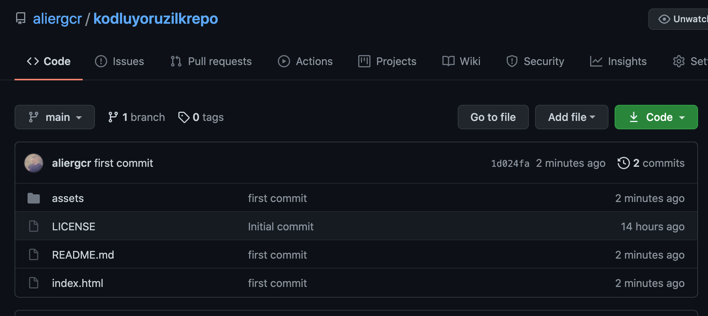

# Kodluyoruz Ilk Repo

Bu repo [Kodluyooruz](www.kodluyoruz.org) Front-End Eğitiminde oluşturduğumuz ilk repo. İçerisinde bir adet README dosyası, bir adet de index.html barındırıyor.



## Installation

Öncelikle projeyi clonelayın

```
https://github.com/aliergcr/kodluyoruzilkrepo.git
```

## Usage

Projeyi cloneladıktan sonra Visual Studio Code ile açın

Linux için :

```
cd kodluyoruzilkrepo
code .
```

## Contributing

Pull requestler kabul edilir. Büyük değişiklikler için, önce neyi değiştirmek istediğinizi tartışmak için bir konu açınız.

## License

MIT
